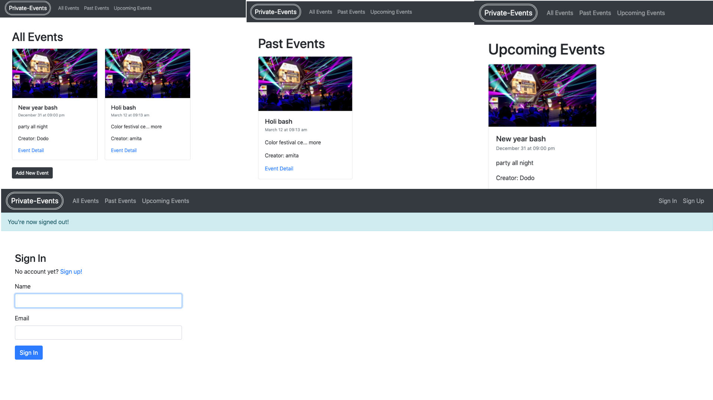

# Private-events

This is the project to learn about associations.

## Built With

- Ruby
- Rubocop
- Ubuntu
- Rails
- Mac

## Prerequisities

To get this project up and running locally, you must already have ruby and rails installed on your computer.

## Getting Started

**Setup**

- Clone this repository with `https://github.com/mcihadkurel/private-events.git` using your terminal or command line. 
- Change to the project directory by entering `cd private-events` in the terminal 
- Next run `bundle install` to install the necessary dependencies 
- run `rails db:create`
- Run `rails db:migrate` to setup your local database. 
- Finally run `rails console` to start the application. 

## Authors

👤 **Muhammed Cihad Kurel**

- Github: [@mcihadkurel](https://github.com/mcihadkurel)
- Twitter: [@mece_ka](https://twitter.com/mece_ka)
- LinkedIn: [@muhammed](https://www.linkedin.com/in/muhammed-cihad-8187581a8/)

## 🤝 Contributing

Contributions, issues and feature requests are welcome!

## Show your support

Give a ⭐️ if you like this project!
